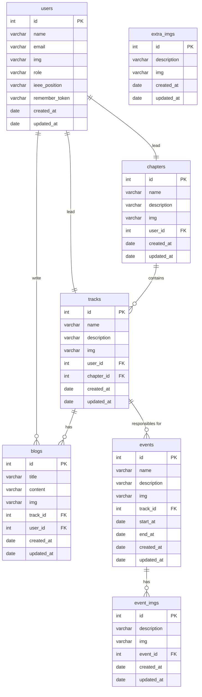

# 1. IEEE-Main-Website ERD

***This is the database structure for the main IEEE website.***
- All users are initially treated as Guests.
- Only Super Modulators or Modulators can register.

### Who will use this website
1. **Super Modulators** :
   - Can add Chapters and Tracks.
   - Can promote authenticated users to **Modulators**.
   - **Super Modulators** have all permissions of **Modulators**
2. **Modulators** :
   - Can create Blogs, add Events, and upload Images.
   - Modulator can't delete another Modulator’s blog or event
3. **Users(Guests)** :
   -  Can view all Blogs, Events, Chapters, Tracks, and Images.
   -  Cannot create or edit content.
   -  Cannot wirte comment or add react .

### Image Storage Rules
1. Images related to events are stored in the event_imgs table.
1. Any general images (not linked to a specific event) are stored in the extra_imgs table.

---

### Schema 

